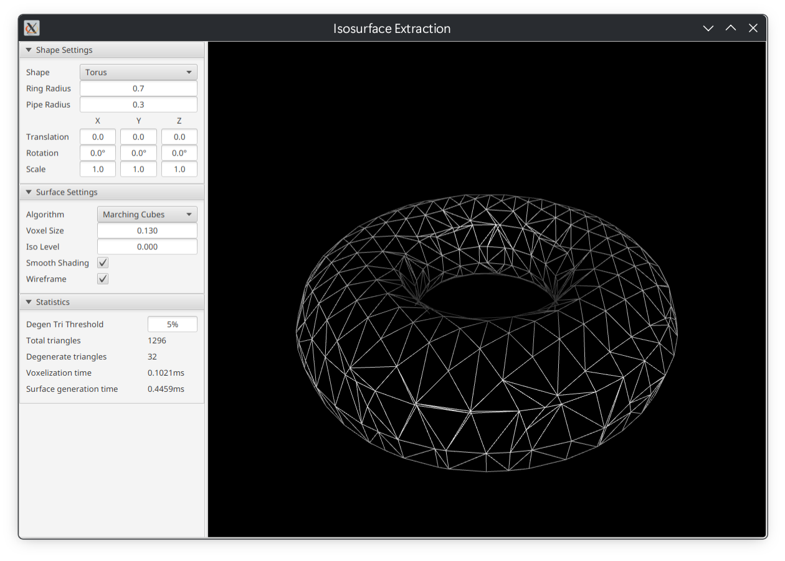

# Isosurface Extraction

A GUI application for testing and comparing various isosurface extraction algorithms.

This application is written in Java using JavaFX, for the purpose of learning and practicing both.

## Supported algorithms

- Blocky
- Marching Cubes
- Surface Nets
